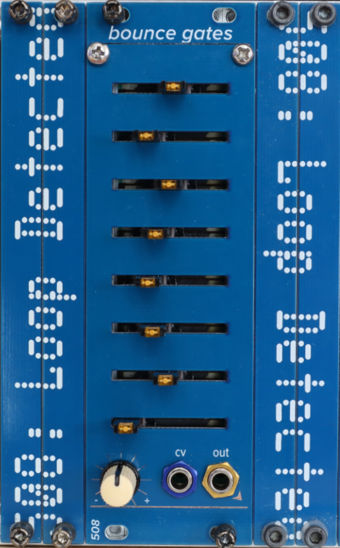

# bounce gates

This is the optional variable gates sidecar for the bounce sequencer & the minibounce. It WILL NOT WORK WITHOUT ONE OF THEM. This module connects to the back of a bounce sequencer with an 8-pin ribbon cable; all of the control of direction, bounce, etc is pushed across that expansion bus from the bounce. This module will do literally nothing if it's by itself.

Calibration is as follows: 

- The trimmer labeled LED-V sets the LED brightness.
- The trimmer labeled 8V should be set initially to 8 volts. Once you've done that, connect everything up, center the CV pot at the bottom left (I use one with a center detent), and slide all the sliders far left. Then, either watching the output with a fast oscilloscope, or (better) using this module to drive a fast envelope, adjust the 8V trimmer CCW until you don't see/hear any gates firing. 

This module, like many of my modules, uses 2mm-pitch male/female headers. Be sure you order/use the right thing!

Most ICs are SOIC 8/14/16; all passives are 0805. The BOMs prefixed with `fixed` are easier to read; the others can be used along with the Pick-and-place and gerber files to order PCBs.
